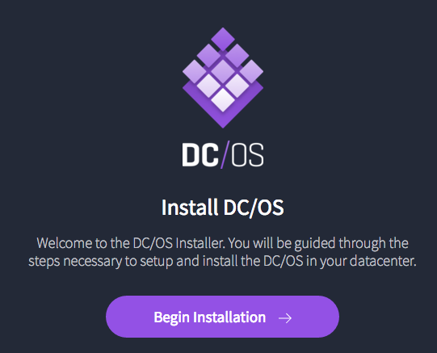
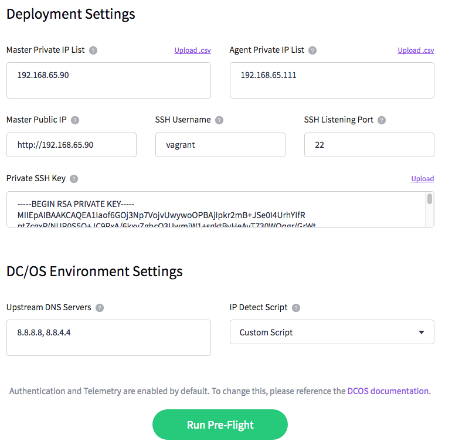
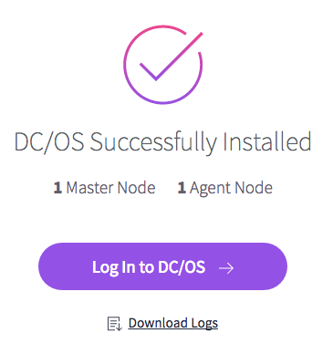

# Alternate Install Methods

DC/OS supports 3 primary installation methods:

- [Advanced](#advanced-installer) - command line manual installation (default)
- [CLI](#cli-installer) - command line automated installation using SSH
- [GUI](#gui-installer) - browser-based installer

By default, DC/OS Vagrant uses the Advanced installation method, with tweaks specific to Vagrant. But the other two methods are also supported, for experimentation and automated testing.

# Advanced Installer

The advanced installer is supported and fully automated.

For the official documentation, see the [GUI DC/OS Installation Guide](https://dcos.io/docs/latest/administration/installing/custom/advanced/)

Optionally, export the following environment variable before performing `vagrant up`:

```
export DCOS_INSTALL_METHOD=ssh_pull
```

Then follow the normal [DC/OS Vagrant Deploy Steps](/#deploy).

**Note**: Advanced Installer supports both Public and Private Agent Nodes.


# CLI Installer

The CLI installer is supported and fully automated.

For the official documentation, see the [GUI DC/OS Installation Guide](https://dcos.io/docs/latest/administration/installing/custom/cli/)

First, export the following environment variable before performing `vagrant up`:

```
export DCOS_INSTALL_METHOD=ssh_push
```

Then follow the normal [DC/OS Vagrant Deploy Steps](/#deploy).

**Note**: CLI Installer does not currently support Public Agent Nodes.


# GUI Installer

The GUI installer is supported, but requires manual intervention to fill out and navigate the web forms.

For the official documentation, see the [GUI DC/OS Installation Guide](https://dcos.io/docs/latest/administration/installing/custom/gui/)

First, export the following environment variable before performing `vagrant up`:

```
export DCOS_INSTALL_METHOD=web
```

Then follow the normal [DC/OS Vagrant Deploy Steps](/#deploy).

**Note**: GUI Installer does not currently support Public Agent Nodes.

After `vagrant up`, when the installer says `Starting DCOS installer in web mode`, open the DC/OS GUI Installer at <http://boot.dcos:9000/>.



On the next page, the installer prompts you with form fields. The values to enter into these field can be found at the pre-generated `config.yaml` and `ip-detect` files that should be at the root of the dcos-vagrant repo (copied there by the vagrant provisioner).



1. Enter the Master Private IPs from `config.yaml` - `master_list`.
1. Enter the Agent IPs from `config.yaml` - `agent_list`.
1. Enter the first Master Public IP from `config.yaml` - `master_list[0]` prefixed with `http://` (auto-filled).
1. Enter the SSH Username from `config.yaml` - `ssh_user`.
1. Enter the SSH Listening Port from `config.yaml` - `ssh_port` (auto-filled).
1. Enter the Private SSH Key from `.vagrant/dcos/private_key_vagrant` (auto-filled).
1. Enter the Upstream DNS Servers `config.yaml` - `resolvers` (auto-filled).
1. Select `Custom Script` for `IP Detect Script` and select `ip-detect`.

Then select `Run Pre-Flight`.


